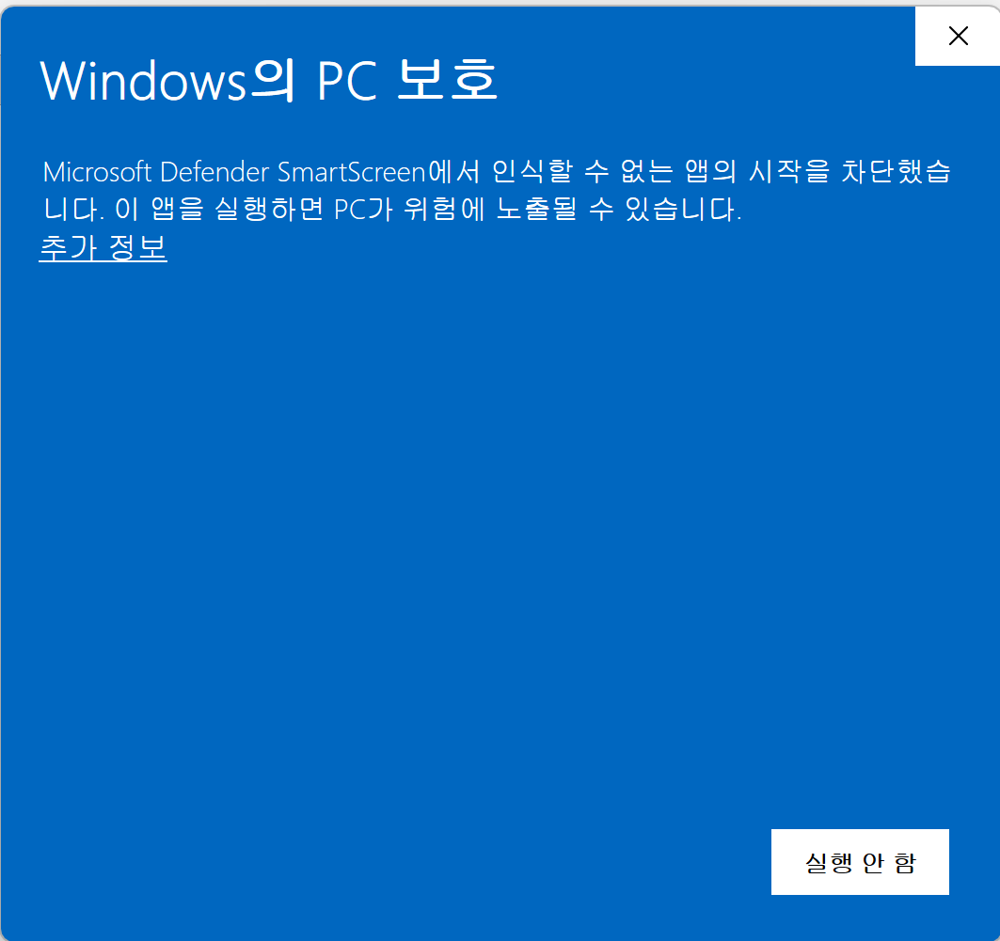
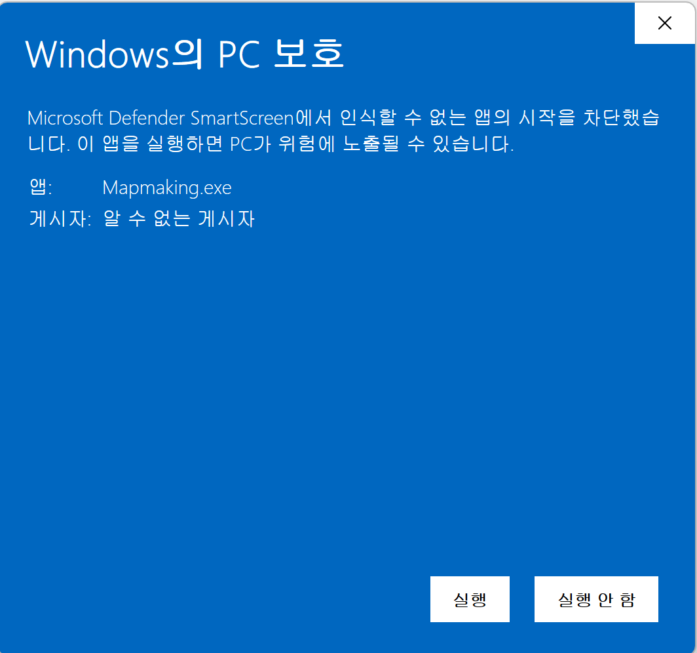
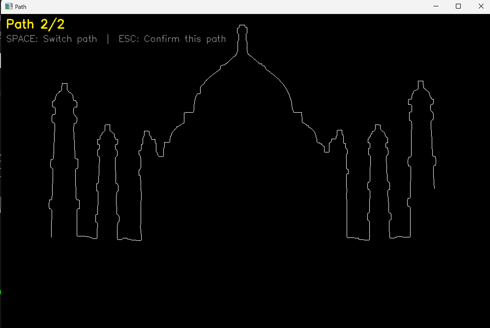
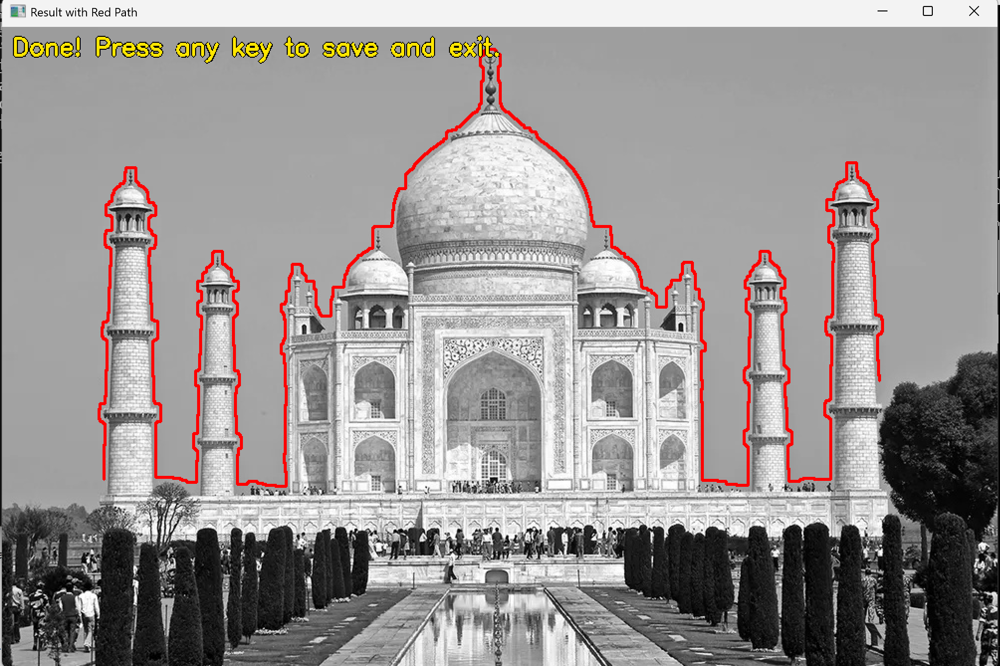
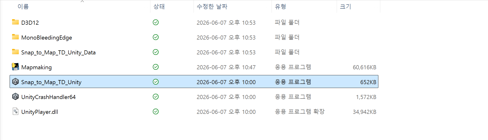
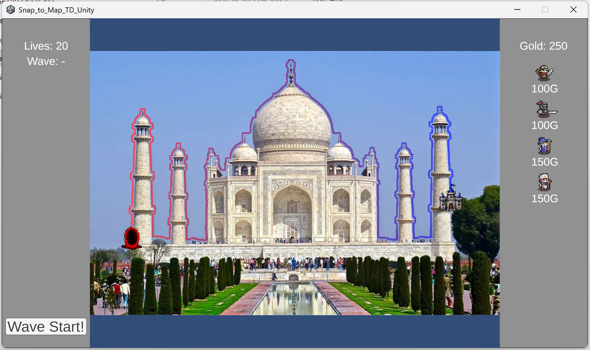
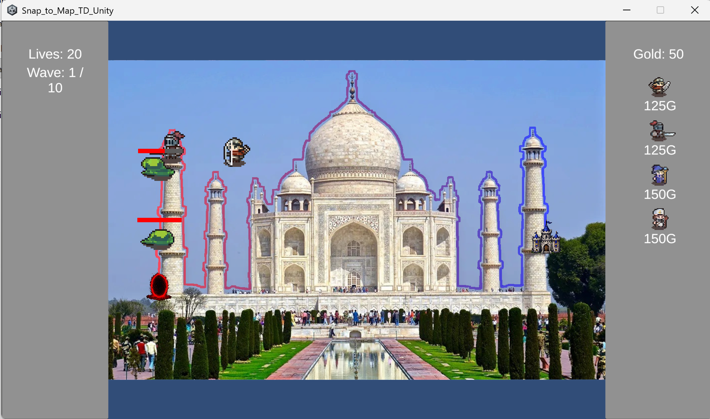
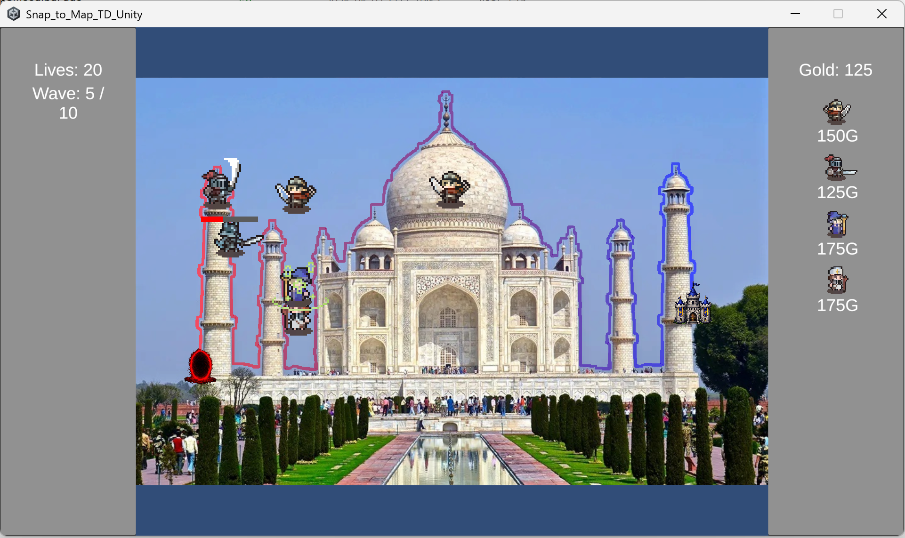

# Snap to Map TD

**사진 한 장이 타워 디펜스 맵이 됩니다.**  
도로나 길 사진을 찍고, 맵 생성 도구를 실행하면 그 위에서 바로 플레이할 수 있습니다.

---

## 동작 방식

```
사진 (.jpg/.png)  →  Mapmaking.exe  →  path_data.json + 배경 이미지  →  게임 실행
```

1. **Mapmaking.exe**가 OpenCV로 이미지를 분석하고 경로를 추출합니다.
2. 게임이 경로 데이터를 불러와 사진을 맵으로 렌더링합니다.

---

## 시작하기

### 1단계 — 맵 생성

빌드 폴더에서 **Mapmaking.exe**를 실행합니다.


> **참고:** 서명되지 않은 실행 파일이므로 처음 실행 시 Windows Defender SmartScreen 경고가 뜰 수 있습니다. **추가 정보** 를 클릭한 뒤 **실행** 을 누르면 정상적으로 실행됩니다.

| 경고 화면 | 추가 정보 클릭 후 |
|:---------:|:-----------------:|
|  |  |

파일 선택 창에서 맵으로 사용할 이미지를 선택합니다.


에지 검출 결과가 표시됩니다. 경로의 **시작 지점**과 **끝 지점**을 순서대로 클릭합니다.


`Space`로 두 경로 후보를 전환하며 원하는 경로를 선택합니다.



`ESC`로 선택을 확정하면 원본 사진 위에 경로가 표시됩니다. 아무 키나 누르면 저장됩니다.



---

### 2단계 — 플레이

빌드 폴더에서 **Snap_to_Map_TD_Unity.exe**를 실행합니다.



생성한 맵이 자동으로 로드됩니다. 경로 옆에 타워를 배치하고 **Wave Start**를 클릭합니다.



적들이 경로를 따라 이동합니다.



타워를 강화하고 10웨이브를 버텨내세요!



---

## 타워

| 타워 | 비용 | 설명 |
|------|------|------|
| **아처** | 100G | 원거리 단일 공격. 스킬: 화살 세례 (범위 공격) |
| **나이트** | 100G | 근거리 범위 공격, 두 가지 패턴을 번갈아 사용. 스킬: 휠윈드 |
| **위자드** | 150G | 단일 대상에게 파이어볼 발사. 스킬: 블리자드 (범위 + 슬로우) |
| **프리스트** | 150G | 신성 투사체 공격. 스킬: 가장 가까운 타워의 공격속도 버프 |

- 타워를 클릭하면 **강화** 또는 **판매** 가능
- 판매 가격은 투자 골드의 절반
- 같은 타워 종류를 추가 배치할 때마다 비용 **+25G**

---

## 적

오크 · 스켈레톤 · 슬라임 · 웨어베어 · 웨어울프  
10웨이브에 걸쳐 체력, 이동속도, 골드 보상이 다른 다양한 적이 등장합니다.

---

## 요구 사항

- Windows 10/11 (64-bit)
- 해상도: 1920×1080, 창 모드 권장

---

## 기술 스택

- **Python** — OpenCV 에지 검출, BFS 경로 탐색, JSON 내보내기
- **Unity 6** — 2D 게임 엔진 (C#)

---

## 다운로드

최신 빌드는 [Releases](https://github.com/kimsun1028/Snap_to_Map_TD/releases) 페이지에서 받을 수 있습니다.
